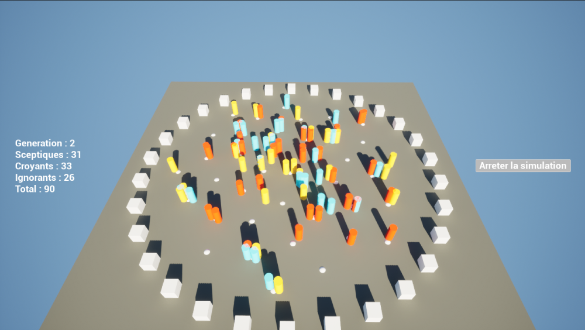
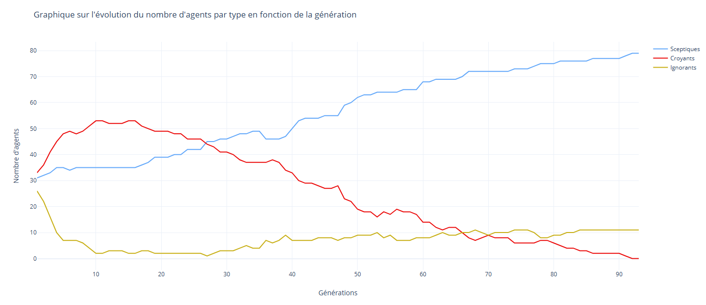

# **Proof of Concept : Simulation de la Propagation d’une Idée/Fake News**  

## **Introduction**  

Les simulation appartiennent à la **théorie des jeux**, développée par **John von Neumann**, c'est une branche des mathématiques qui étudie **les décisions stratégiques** dans des environnements où plusieurs acteurs interagissent. 

Dans notre simulation :  

- **Les croyants et sceptiques** sont des **joueurs** qui tentent **d’imposer leur vision** du monde.  
- **Les ignorants** représentent **des agents passifs**, qui peuvent être influencés par l’un ou l’autre camp.  
- Chaque rencontre est une **interaction stratégique**, où les agents modifient leur état en fonction des **règles prédéfinies**.

### **Application du Dilemme du Prisonnier**  

Un parallèle peut être fait avec le célèbre **Dilemme du Prisonnier**, où :  

- Un individu peut **coopérer** (changer d’avis) ou **résister** (maintenir sa position).  
- L’issue dépend **du nombre d’alliés ou d’opposants** présents dans un échange.  
- Un groupe avec **trop de sceptiques** réduit la propagation de l’idée, tandis qu’un groupe avec **trop de croyants** peut convertir les autres.  

## **La Simulation de Fake News**  

Cette simulation explore la diffusion d’une idée ou d’une fake news au sein d’une population. Inspirée par des modèles épidémiologiques et sociaux, elle classe les individus en trois catégories :  

- **🔵 Sceptiques** : rejettent l'idée.  
- **🔴 Croyants** : adoptent et propagent l'idée.  
- **🟡 Ignorants** : neutres, influençables par leur entourage.  

L’objectif est d’analyser l’évolution de ces groupes au fil du temps et d’observer si une idée peut se propager jusqu’à une adoption quasi-généralisée ou si un équilibre se crée entre croyance et scepticisme.  

## **Les Règles**

### Règle 1

**Propagation de l’idée :**
Un **ignorant 🟡** devient **croyant 🔴** (ou plus rarement **sceptique 🔵**) s’il est exposé à au moins un croyant avec une probabilité de conversion P.

P est influencé par le nombre de **croyants 🔴** autour de l’ignorant, et de l’aléatoire.

---

### Règle 2

**Fact-Checking :**
Un **croyant 🔴** peut redevenir **ignorant 🟡** ou même **sceptique 🔵** s’il est entouré de 3 **sceptiques 🔵** ou plus.

Il y a 30 % de chance qu’il doute de sa croyance et retourne à un état neutre (ignorant).

---

### Règle 3

**Sceptiques Réformables :**
Un **sceptique 🔵** peut redevenir **ignorant 🟡** s’il est entouré d’au moins 5 **sceptiques 🔵**.

## **Fonctionnement de la Simulation**  

La simulation fonctionne en **tours** successifs (1 tour est une "génération") :

1. **Déplacement aléatoire des agents** vers des points de rencontre.  
2. **Interactions locales** où les règles d’influence sont appliquées.
3. **Mise à jour des statuts** et redémarrage du cycle.  

---

## **Résultats de la Simulation**

Les données issues de 93 générations, avec 45 points de rencontres et 90 agents équitablement répartits montrent les tendances suivantes :  

- Le nombre de **sceptiques 🔵** augmente progressivement, passant de **31 à 79**.  
- Les **croyants 🔴** ont initialement dominé mais finissent par disparaissent quasi totalement après 90 générations.  
- Les **ignorants 🟡** sont très vite devenu croyants et sceptiques pour certains, puis leur nombre à ré-augmenter légèrement pour stagner aux alentours de **0 à 10** individus.

### **📊 Visualisation des données**  

- **Phase 1** : Les croyants **se propagent rapidement**, atteignant un pic autour de la génération 40.  
- **Phase 2** : Progressivement, la résistance sceptique **influence** les croyants, qui redeviennent sceptiques ou ignorants.  
- **Phase 3** : À long terme, le scepticisme domine la population.  

---

## **Comparaison avec la Réalité**  

Ces résultats reflètent certaines tendances sociologiques observées dans la diffusion d’une idée :  
✅ **Phase initiale d’adoption rapide** : Similaire aux tendances virales sur les réseaux sociaux.  
✅ **Résistance et fact-checking** : Les sceptiques peuvent inverser la tendance, comme dans les débats médiatiques.  
✅ **Disparition des individus neutres** : Phénomène courant dans les polarisations d’opinion.  

Mais, la simulation ne prend pas en compte certains facteurs réels :  
❌ **L'influence des leaders d’opinion** (politiques, médias).  
❌ **L’impact des algorithmes des réseaux sociaux**, qui amplifient certaines idées.  

---

## **Conclusion**  

Cette simulation illustre **comment une idée peut se propager et évoluer** au sein d’une société. Bien qu'elle simplifie la réalité, elle met en évidence des dynamiques cruciales :

- La **vitesse de propagation** d’une idée.  
- L’impact du **fact-checking** et du scepticisme.  
- L’**évolution d’un système fermé** sans intervention extérieure.  

Pour aller plus loin, il serait intéressant d’introduire des **facteurs externes** (médias, influenceurs, régulation) afin de voir comment ces éléments pourraient **inverser ou accélérer la diffusion** d’une idée.

## Sources :

[Théorie des jeux](https://fr.wikipedia.org/wiki/Th%C3%A9orie_des_jeux)

[Dilemme du prisonier | Arte](https://www.youtube.com/watch?v=G9ER5bLxQEU)

[Simuler levolution |Primer](https://labs.minutelabs.io/evolution-simulator/#/s/2/viewer?intro=)